# TAAG

## About me :

I'm Jeremy, 25 years old, 1st years student at 42 school, in Paris.
I used to work at an engineering office from my 18 years until november 2017, when I decided to quit, and start learning c/c++/C# programmation.

After finishing the mandatory project for 42, I decided to work on my own on SDL2 and OpenGl. After 2 months of testing, learning things and reading SDL2/OpenGL documentation, I started to create my first game, TAAG.

## The project :

TAAG is a 2D tactical arena game. The idea is to fight a group of enemies over a square-tiled map. For that, the player's character have access to different spells, with multiple effect types.

After the match, the player will win experience and gold, which he can use to buy new spells, maps and looks for his characters.

## Screenshot :

### Starting menu (Player mode)
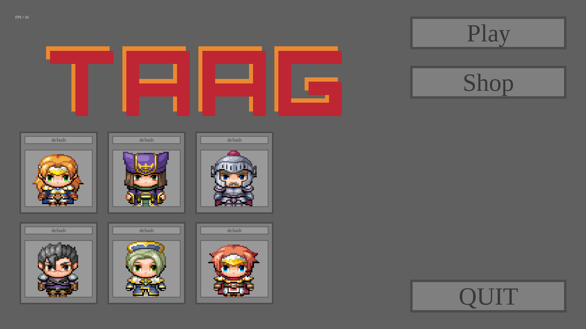

### Starting menu (Editor mode)
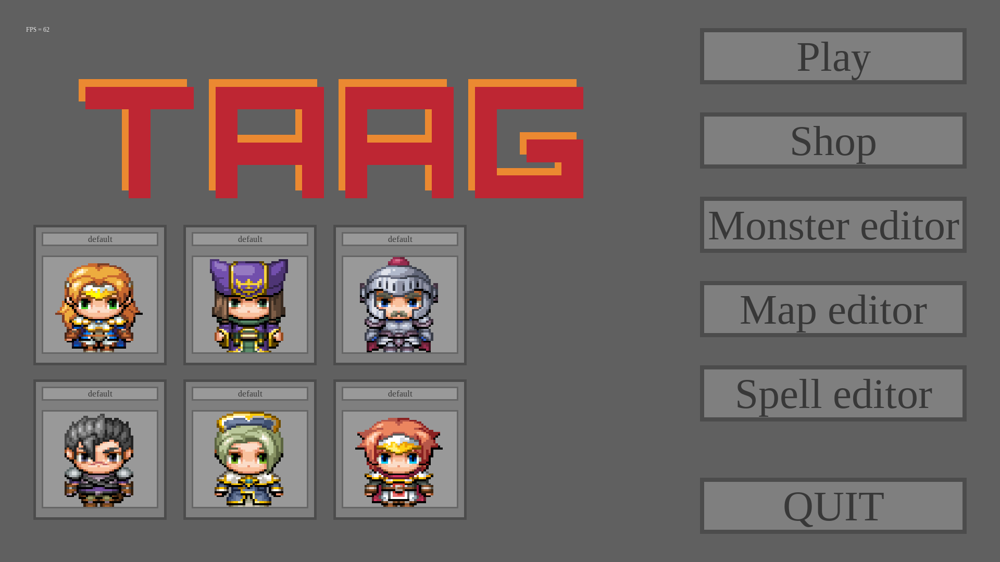


### Character editor
#### Basic player editor
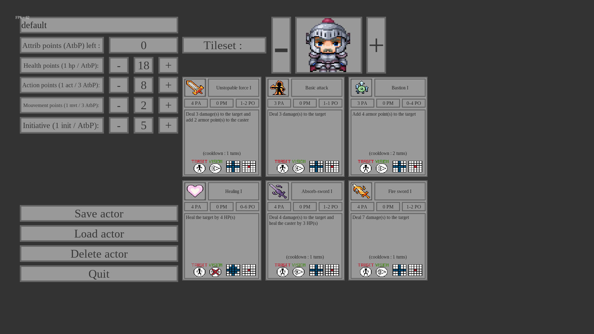
#### Sprite selector
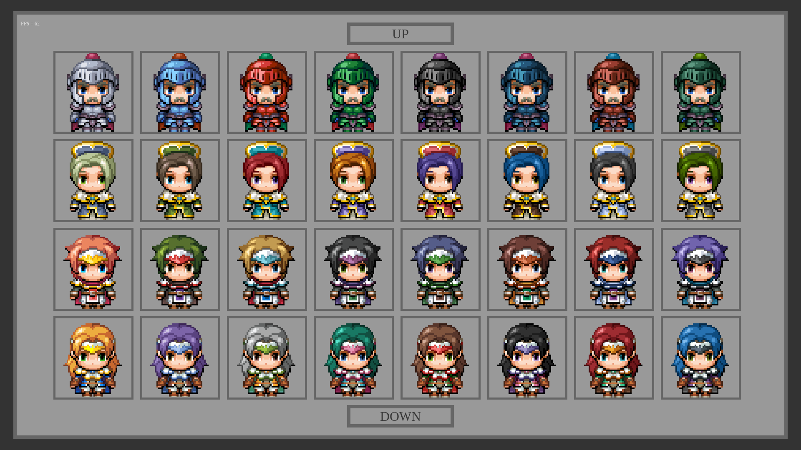
#### Spell selector
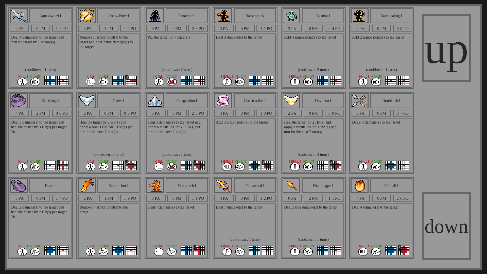

### Monster editor addon to the character editor
#### AI editor
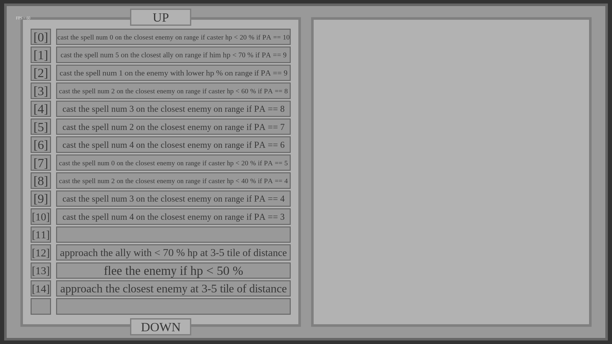

### Spell editor
#### Spell settings
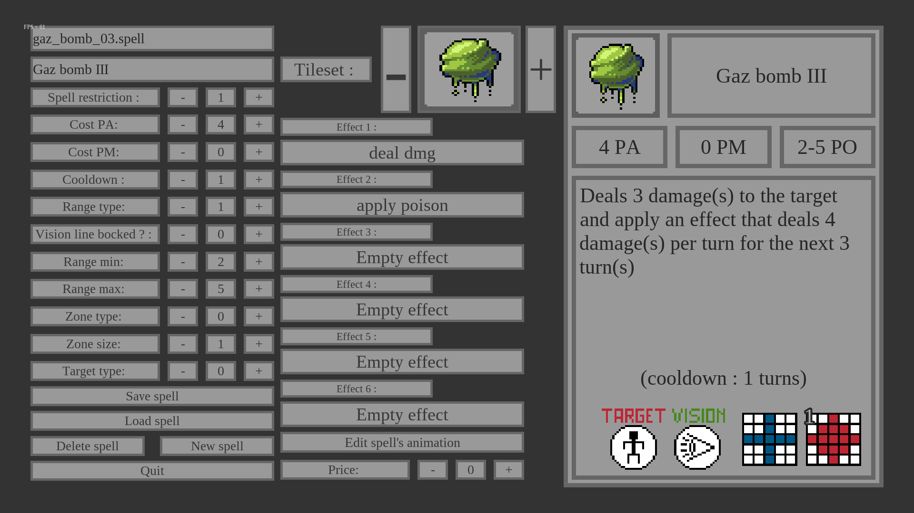
#### Animation settings
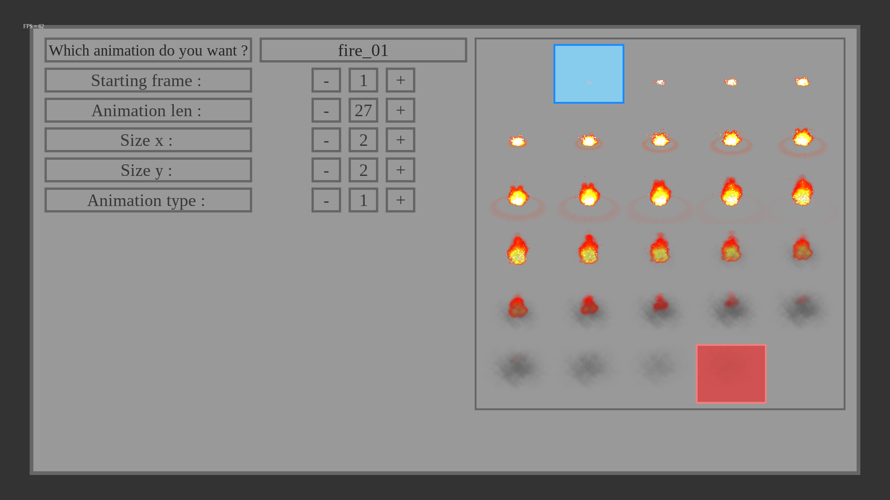

### Map editor
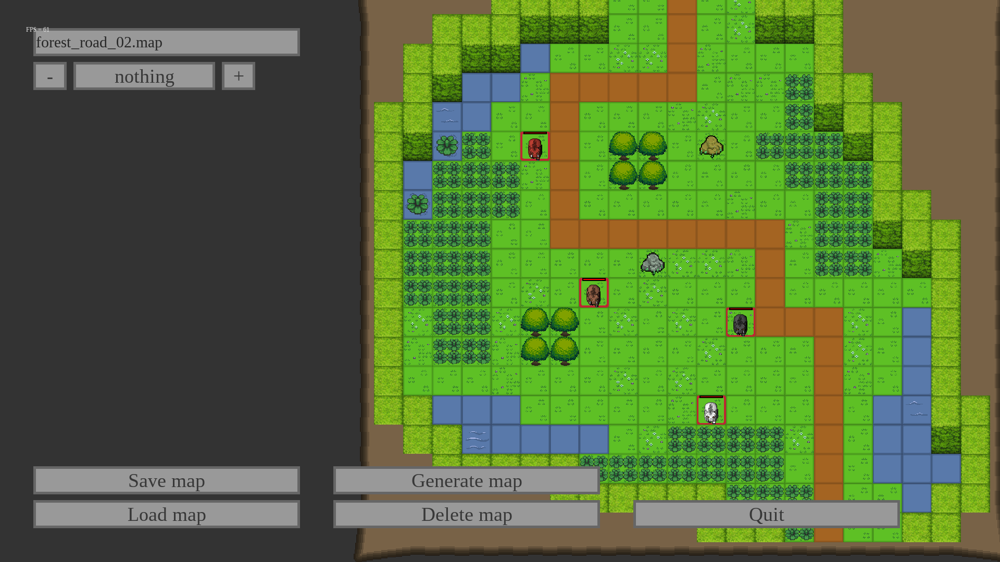

### Game - principal game loop
#### Pathfinding
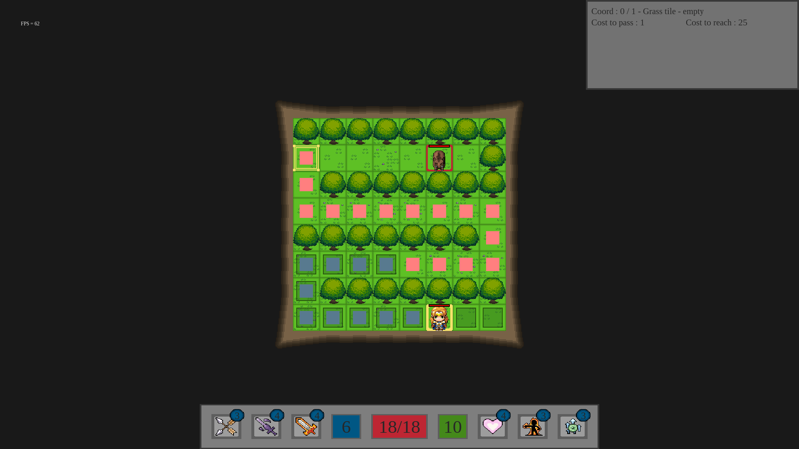
#### Vision line
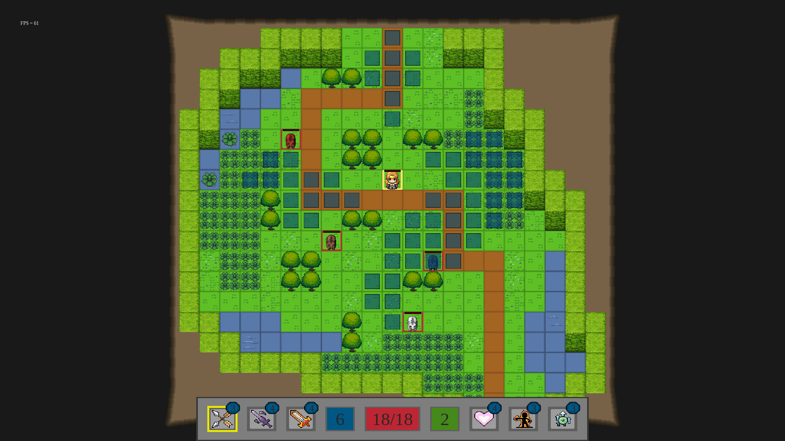
#### Animation when casted
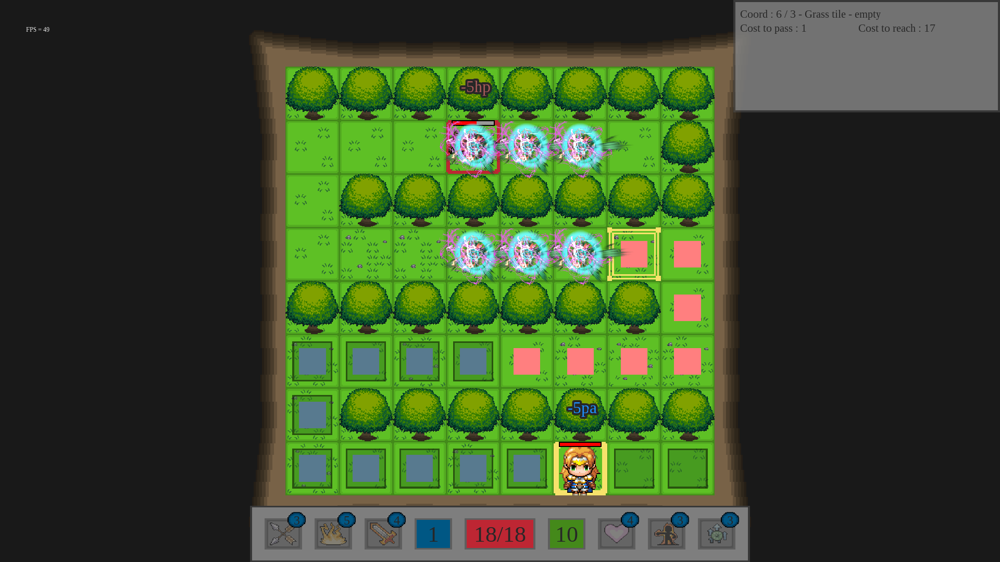

### Game - end game menu
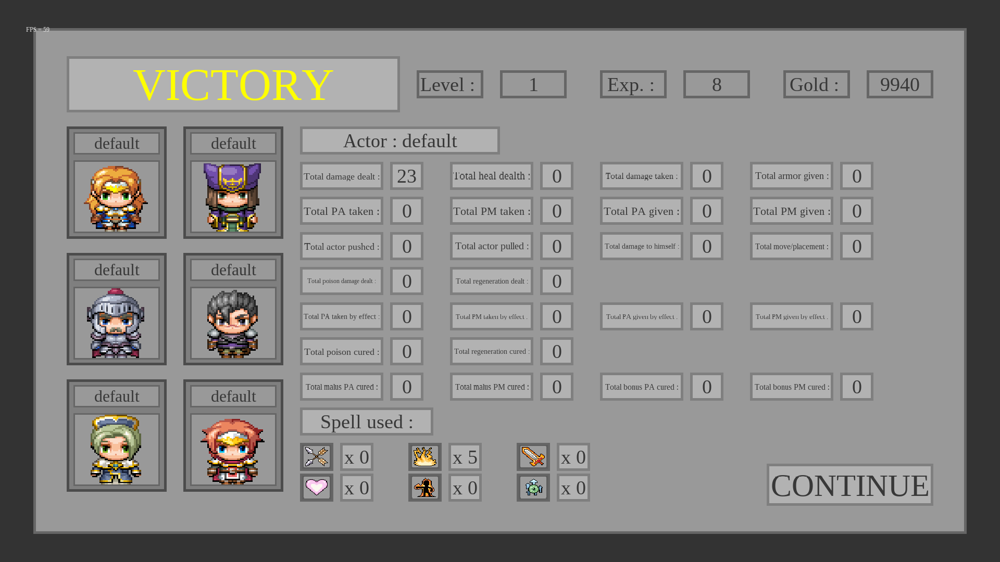

## Installation :

### Windows
```
Link :
```

[TAAG-Installer.msi](https://drive.google.com/open?id=1xsZ6ITREkvIzhX4wHdFt207bGUUx6R1r)
```
Requirement :
Nvidia graphical-card
Windows drivers updated

Setup :
Download the .msi file, and use it.
Launch TAAG from your desktop or your start menu. (Sometimes TAAG doesn't start with the proper graphical card. If you have any graphical problems, it's probably because of this. Right click on the exe and choose to launch it with your Nvidia card).
```

### MacOS
```
Requirement :
* Brew

Setup :
Simply git clone this repot, open it on a terminal then use the command "make install"
Use ./TAAG-game in the folder to launch it
```

### Linux
```
Working on it
```
