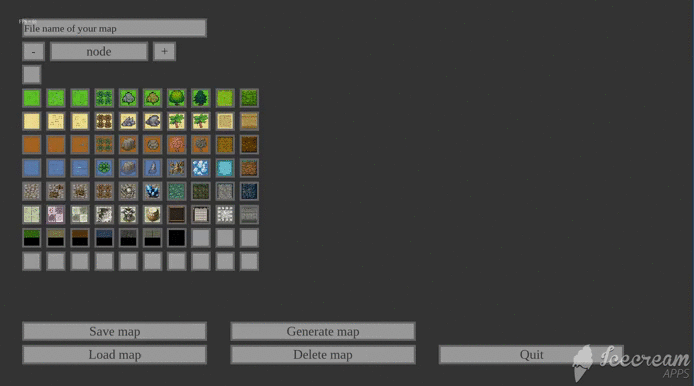
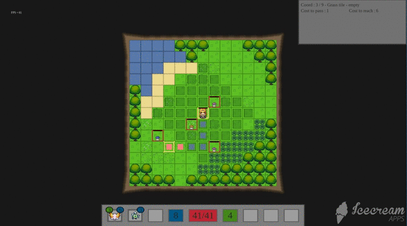
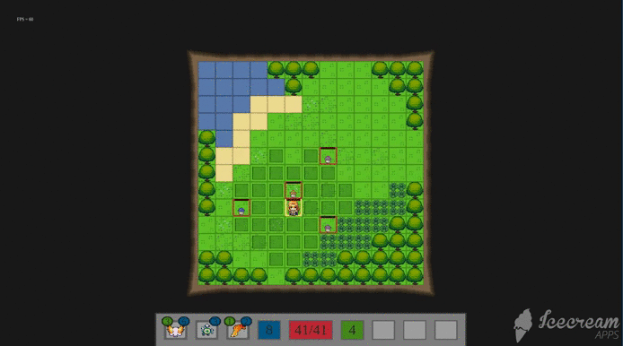
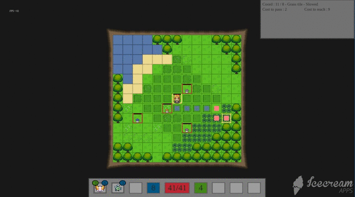

# 2D Tactical RPG Engine

## About me :

I'm Jeremy, a 25 years old, 1st year student at 42 school, in Paris.
I used to work at an engineering office from my 18 years until november 2017, when I decided to quit, and start learning c/c++/C# programmation.

After finishing the mandatory project for 42, I decided to work on my own on SDL2 and OpenGl. After 2 months of testing, learning things and reading SDL2/OpenGL documentation, I started to create my first graphical library (Availible here : 
[Graphical library](https://github.com/Hyarius/Graphical_library)), and a demo of it by creating a 2D game engine.

## The project :
I created an custom 2D engine, multiple systems (to handle AI, player interaction with the world, a polyvalent effect system for attacks/abilities, animations, etc) and multiple editors to enable content creation inside my project.

I'm also working on a 3D modul of this project ([3D game engine](https://github.com/Hyarius/TAAG-3D-redesign/blob/master/README.md))

## Screenshot :

### Editors
#### AI


#### Spell


#### Map 


### Game - principal game loop
#### Pathfinding

#### Vision line

#### Animation when casted



## Installation :

### Windows
```
Link :
```

[TAAG-Installer.msi](https://drive.google.com/open?id=1xsZ6ITREkvIzhX4wHdFt207bGUUx6R1r)
```
Requirement :
Nvidia graphical-card
Windows drivers updated

Setup :
Download the .msi file, and use it.
Launch TAAG from your desktop or your start menu. (Sometimes TAAG doesn't start with the proper graphical card.
If you have any graphical problems, it's probably because of this.
Right click on the exe and choose to launch it with your Nvidia card).
```

### MacOS
```
Requirement :
* Brew

Setup :
Simply git clone this repot, open it on a terminal then use the command "make install"
Use ./TAAG-game in the folder to launch it
```
